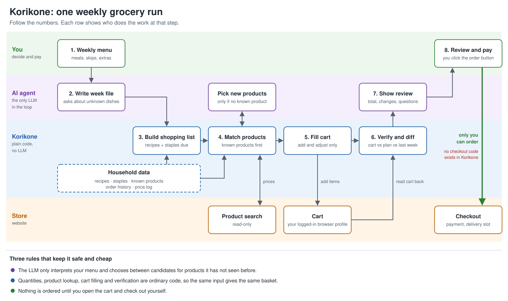

# Korikone design

Korikone ("basket machine") turns a weekly family menu into a filled online grocery cart. An AI agent interprets the menu, ordinary code does the rest, and a human always places the order.

This is a hobby project for one household. The design favours things that are quick to build and easy to fix over things that scale.



## Goals

- Cut the weekly shopping chore to one short message and a five-minute cart review.
- Spend less by buying the cheapest acceptable product per ingredient and, later, by planning meals around offers.
- Never place an order without the human doing it themselves.

## Non-goals

- Automated checkout or payment, now or later.
- Pantry inventory tracking.
- More than one store, household or user.
- A web or mobile UI. The agent's chat is the interface.
- Running unattended on a schedule.

## How one run works

1. **You** send the week's menu in free text, with anything to skip or add.
2. **The agent** turns that into a structured week file. If a dish has no recipe on file, it proposes one and asks you to confirm before saving it.
3. **Korikone** builds the shopping list: recipe ingredients scaled and merged, plus the staples that are due, minus your skips.
4. **Korikone** matches each list item to a product. Known products are looked up directly and priced from the store. Items with no known product come back as a short candidate list, and the agent picks one.
5. **Korikone** adds the products to the store cart.
6. **Korikone** reads the cart back from the store and compares it with the plan and with last week's order.
7. **The agent** shows you the review: total, what changed since last week, and any open questions.
8. **You** open the cart, pick the delivery slot and pay.

## Key decisions

### The agent is the brain, Korikone is the hands

Korikone is a command-line tool with no LLM calls inside it. The agent (Claude Code or Codex to start with) reads your message, runs Korikone commands and talks to you.

This means there are no API keys in the project, the logic can be unit-tested, and any agent that can run shell commands can drive it. Hermes or a local model can be swapped in later without code changes.

A thin MCP wrapper can be added later if an agent needs it. The CLI comes first.

### Known products instead of weekly product search

Most of a family basket repeats. Each ingredient is linked to one or more products the household has already accepted, so matching is a lookup and the basket is the same for the same input.

Each ingredient has a policy:

| Policy | Meaning | Example |
|---|---|---|
| `cheapest` | Pick the lowest unit price this week among the accepted products | pasta, milk, toilet paper |
| `pinned` | Always this product; flag it if unavailable | the kids' yoghurt |
| `ask` | Always return candidates for the agent and you to choose | fish, seasonal produce |

"Cheapest" means lowest price per kg, litre or piece among accepted products, with the pack size limited per ingredient. There is no waste or storage modelling; a maximum pack size covers it.

### Recipes on file

Recurring dishes live in a recipe file with fixed quantities for this family. The LLM only drafts a recipe the first time a dish appears, and you approve it once.

### Staples by cadence

Staples have a "buy every N weeks" cadence seeded from order history. A staple is due when it was last ordered at least N weeks ago. Your weekly message can override either way ("skip cereal", "we're out of dishwasher tablets").

### One store

The first task is to pick S-kaupat or K-Ruoka after comparing a typical basket by hand, including delivery or pickup fees. Store access sits behind a small interface so the choice can be revisited, but only one implementation is built.

### Manual checkout, permanently

Korikone contains no checkout code. The store interface has no method for it, and the browser driver refuses to navigate to checkout URLs. Payment authentication needs a human anyway, and the final click costs seconds.

## Components

```
korikone/
  cli.py            commands the agent runs
  models.py         data classes for week, recipe, list item, product, basket
  planner.py        week file -> shopping list
  matcher.py        shopping list -> basket of products
  review.py         cart vs plan vs last week -> review.md
  db.py             SQLite access
  store/
    base.py         Store interface
    <store>.py      the one real implementation
    fake.py         in-memory store for tests and dry runs
skill/              agent instructions for a weekly run
data/               your household data (not committed)
data.example/       sample files that are committed
runs/2026-W42/      week file, list, basket and review for each run (not committed)
tests/
```

### Commands

| Command | Does |
|---|---|
| `korikone history import` | Pulls past orders from the store into the database |
| `korikone plan <week>` | Writes `list.json` from the week file |
| `korikone match <week>` | Writes `basket.json`; lists unresolved items with candidates |
| `korikone pin <ingredient> <product-id>` | Accepts a product for an ingredient |
| `korikone fill <week>` | Adds the basket to the store cart; `--dry-run` uses the fake store |
| `korikone review <week>` | Reads the cart back and writes `review.md` |
| `korikone offers` | Lists current offers on accepted products (later phase) |

Every command prints JSON with `--json` so the agent does not have to parse prose.

### Store interface

```python
class Store(Protocol):
    def search(self, query: str) -> list[Product]: ...
    def get_product(self, product_id: str) -> Product | None: ...
    def get_cart(self) -> Cart: ...
    def add(self, product_id: str, quantity: int) -> None: ...
    def set_quantity(self, product_id: str, quantity: int) -> None: ...
    def remove(self, product_id: str) -> None: ...
    def order_history(self, since: date) -> list[Order]: ...
```

There is no `clear_cart` and no `checkout`.

The implementation drives a real browser with Playwright, using a dedicated browser profile that you log into by hand once. Where the site exposes JSON to its own front end, the adapter reads that from the page session; otherwise it uses the visible page. A short spike in phase 0 decides which.

Existing community projects for these stores may be useful as reference for how the sites work. They are not dependencies: any third-party code that would run against a logged-in profile is read first.

## Data

Hand-edited files are YAML. Machine-written data is SQLite. Both live in `data/`.

**`recipes.yaml`**

```yaml
spaghetti-bolognese:
  names: [spaghetti bolognese, bolognese, jauhelihakastike ja spagetti]
  serves: family          # quantities are already for this household
  ingredients:
    - {item: ground-beef, amount: 800, unit: g}
    - {item: spaghetti, amount: 500, unit: g}
    - {item: crushed-tomatoes, amount: 800, unit: g}
    - {item: onion, amount: 2, unit: pcs}
```

**`staples.yaml`**

```yaml
milk:               {every_weeks: 1, amount: 8, unit: l}
toilet-paper:       {every_weeks: 5, amount: 1, unit: pcs}
dishwasher-tablets: {every_weeks: 6, amount: 1, unit: pcs}
```

**`ingredients.yaml`**

```yaml
spaghetti:
  policy: cheapest
  max_pack: {amount: 1000, unit: g}
  products: ["<product-id>", "<product-id>"]
kids-yoghurt:
  policy: pinned
  products: ["<product-id>"]
  substitution: never
```

**`runs/<week>/week.yaml`** (written by the agent)

```yaml
week: 2026-W42
meals:
  - {day: mon, recipe: spaghetti-bolognese}
  - {day: tue, recipe: salmon-soup}
  - {day: thu, leftovers: true}
skip: [potatoes, spaghetti, cereal]
extra:
  - {item: dishwasher-tablets, amount: 1, unit: pcs}
budget_eur: 160
```

**SQLite tables**

| Table | Holds |
|---|---|
| `orders`, `order_lines` | Imported and completed orders |
| `products` | Product id, name, pack size, last seen price |
| `price_log` | Product, date, price, unit price, offer flag |

Units are grams, millilitres and pieces only. Recipes are written in those units, so there is no conversion logic.

## Safety and failure handling

| Risk | Handling |
|---|---|
| Order placed by mistake | No checkout code; checkout URLs blocked in the driver |
| Wrong items or quantities in the cart | Cart is read back and compared with the plan; mismatches are listed at the top of the review |
| Runaway quantity | A line above 10 units needs an explicit flag in the week file |
| Over budget | Review shows the total against `budget_eur`; the agent must point it out |
| Cart not empty at start | `fill` stops and reports what is there; you decide whether to keep or remove it |
| Store site changes | Adapter fails loudly with the page saved to `runs/<week>/debug/`; nothing is half-reported as done |
| Product unavailable | Next accepted product if the policy is `cheapest`; otherwise flagged as an open question |
| Store terms or bot detection | One household, one run a week, human-speed pacing, no bulk scraping. If the store blocks it, the fallback is Korikone producing the list and you filling the cart |
| Login session theft | Dedicated browser profile outside the repo; nothing stores the password |
| Personal data in git | `data/` and `runs/` are git-ignored |

## What is deliberately skipped

These are corners cut on purpose because this is a side project:

- No CI pipeline. Tests and linting run locally before a commit.
- No database migrations. If the schema changes, re-import the history.
- No retries or resilience layer in the store adapter beyond one retry per action.
- No live tests against the store in the test suite. Adapter parsing is tested against a few saved pages.
- No configuration system. Paths and the store name are constants in one file.
- No packaging or releases. It runs from the repo.

What is kept: type hints, unit tests for the planner, matcher and review logic, a linter and formatter, small commits, and secrets and personal data kept out of git.

## Open questions

1. Which store? Decided in phase 0.
2. Can order history be read from the store account, or does it need to be seeded from emailed receipts?
3. Do loyalty or personal offer prices show up in the same place as regular prices?
4. Is the delivery slot needed before prices are correct? If so, you pick the slot before the run starts.
