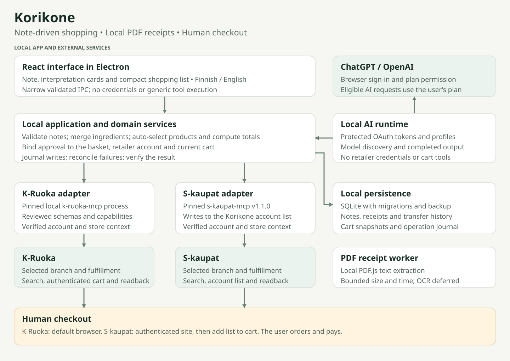

# Korikone design

Revised 9 October 2026 after the first user feedback round. The current direction follows `scratch/feedback2.md` and `scratch/Korikone redesign.pdf`, with the original `scratch/feedback1.md` as context. The source PDF is a reference, not a claim about live prices or available products.

Korikone turns a household's plain-language shopping note into an editable, priced shopping list. Meals, ready foods, breakfasts, evening foods and treats belong in the same note. Product choices happen automatically; the user corrects exceptions and reviews the resulting cart changes. Checkout stays in the retailer.

Current published delivery: **0.2.0-alpha.2 pre-release**. See [pre-release scope and gates](pre-release.md). This stage preserves the current design and focuses on distributable builds and observed acceptance. Development and automated checks use local fixtures; live ChatGPT tests require an explicit user request.

## Product decisions

| Decision | Behavior |
| --- | --- |
| Note-driven shopping | One input replaces the competing prompt and weekday-entry controls. No setup toggles for categories already expressed in the note. |
| Visible interpretation | “Näin ymmärsin” cards show meals or grocery groups, ingredient counts, estimated cost shares and portions. Selecting a card highlights its list rows. |
| Automatic local list updates | After a 1.8-second typing pause, run a single AI request. Ctrl+Enter or the arrow requests an immediate update. A later note supersedes an earlier response. |
| Automatic product matching | Prefer an explicit saved selection when available. Otherwise choose sufficient packs at the lowest total cost within the brand preference. |
| Deterministic shopping calculations | AI supplies recipes and grocery amounts. Code merges ingredients, scales portions, chooses packs, computes totals and applies cart changes. |
| Separate optional scheduling | “Viikkosuunnitelma” places the current list's cooked meals on upcoming dates. It does not add ingredients or regenerate the list. |
| Local Windows app | Electron, React and TypeScript; local SQLite; Finnish first and English available throughout. |
| Manual checkout | A cart transfer is not an order or payment. Purchase confirmation alone advances recurring-item cadence. |

## Main workspace

Use a quiet green/white palette, a compact heading, a left navigation rail, a note and interpretation area, and a complete shopping list on the right. At narrow widths, stack the list below the note. Use the Windows title-bar overlay rather than drawing fake window buttons.

The note footer shows household size, current date and selected branch. Settings remain one click away. Explain that the note, recipes, household preferences and imported receipt text are sent to ChatGPT. Do not fabricate prices, history, account names or connection states from the mockup.

Every list row includes the chosen product or unresolved ingredient, source meals, required amount, quantity controls, price when known, a home marker and removal (shown on hover or keyboard focus), and details that open from the product name with the product picker. Shared ingredients appear once with additive amounts and all source meals. “Löytyy kotoa” leaves a visible row but excludes it from matching and totals. Removal hides the row independently; restoring home items does not restore removed rows.

Put clear-list and text export in the list menu. Keep the running total and the transfer button in a bar pinned to the bottom of the list column, which scrolls on its own; copy/save actions sit above it. Keep all rows available; do not collapse a long list behind “show more.” A missing quote is shown as unknown and excluded from the estimate.

Saved recipes are added through a disclosure, without choosing a day. Recurring items appear under “Unohtuiko jotain?” and can be added with one click. Existing enabled recurring items retain their cadence behavior. No purchase frequency is inferred from transfer history.

## AI interpretation and updates

`src/ai/draft.ts` validates JSON before any list change. It accepts multiple recipes, existing recipe references and direct grocery items. A recipe can be a cooked meal, ready food, breakfast, evening food or treat group. Frozen pizza stays a purchased food rather than becoming a recipe for homemade pizza.

Recipe-ID collisions are remapped with their references. Ingredient identities are reused for matching Finnish names and units, so shared ingredients add together. Markdown-wrapped JSON is accepted. Unknown references, duplicate incoming recipe IDs, invalid quantities and incomplete JSON are rejected. Validation failure triggers at most one corrective generation attempt. Network, authorization and usage failures do not trigger that retry.

On successful interpretation, replace the current generated list, persist the note and assumptions, and retain saved recipes. Manual list changes made after generation started invalidate its revision. The renderer ignores responses for an obsolete note or an unmounted workspace. Failures leave the saved list intact and show a persistent error. Users can retry with Ctrl+Enter or the arrow.

Cancel is available beside the note while generation runs. It aborts the request, invalidates pending drafts and suppresses automatic submission of the current note. The saved list stays intact and the typed note remains available for an explicit retry. Cancellation has its own status rather than a network-failure alert. Development mode exposes request counts in its snapshots for automated debounce, retry and cancellation checks.

The app discovers a suitable available model automatically. OAuth, credentials, streaming completion checks and usage errors stay in the local AI provider. The renderer never receives tokens. There is no automatic paid API fallback.

## Product selection and transfer

The selection preference is lowest total pack cost, prefer store brands, or avoid store brands. Brand preferences are soft: if no matching brand candidate is usable, other available candidates remain eligible. An explicit product choice takes precedence. Household exclusion terms filter candidates before selection, including saved choices. Only products with known price, compatible unit and positive pack size/increment are automatically selected. This name-based filter cannot certify allergens or dietary suitability.

Alternatives are chosen in the row details. When a cheaper product for the same ingredient exists, the row shows the saving and the details offer the swap; undo stays on the row. Undo changes a local choice; it does not reverse a retailer write. Catalogue data cannot certify dietary suitability; the confirmation panel lists the products under "Näytä kaikki rivit" for the shopper to check.

Transfer flow:

1. Read the current cart and refresh selected product quotes.
2. Show a confirmation panel in the list column with only what needs attention: unresolved ingredients excluded from this batch, products already in the cart, cheaper alternatives for the same ingredient, and a budget overrun. Exact before/after quantities and retained unrelated items are under "Näytä kaikki rivit". A changed price or pack stops the review before this step, so the list is re-quoted first.
3. Apply the batch when the shopper presses the confirm button, which names the product count, chain and total. That press is the approval. A separate acknowledgement is required only when the total is over the weekly budget. Keep revision, account, store, price and quantity checks.
4. Journal each operation and read back the cart. A failure stops the batch and offers reconciliation; never blindly repeat an uncertain write.
5. Show verified and unresolved items in the same panel, with the next step. Save verified runs to local transfer history so they can be reused.
6. For K-Ruoka, open the cart URL in the default browser. S-kaupat retains its authenticated `open_site` handoff and list-to-cart instructions. The user may need to sign into the same retailer account there. The app does not copy browser cookies or claim session continuity.

Unsupported weighted prices and ambiguous pack labels remain unresolved. A partial batch may transfer the available products only after the review lists what is excluded. It must not imply the complete list was transferred. Fees and unreported deposits remain outside the estimate.

## Receipts and history

Receipt import accepts PDF, TXT and CSV. A dedicated worker uses pinned Mozilla PDF.js to extract PDF text locally. Limits are 20 MB per file, 100 PDF pages, 50,000 saved characters, and a 30-second extraction timeout. Invalid, password-protected or textless PDFs produce a specific error and do not change saved receipt data. Scanned/image-only PDFs require OCR before import; automatic OCR is not implemented.

Imported text is visible and editable in settings. It is supplied as untrusted purchase data for subsequent AI suggestions, never as instructions. It is not sent to ChatGPT merely by importing it. Receipt storage is included in local backups.

The new `listHistory` records verified transfers, not completed purchases. Existing `history` entries keep the earlier-week schema and remain reusable through the History view; clearing the list archives its meals there. It stores the note, meal references, extras, home/removal flags and quantity overrides. Reusing an entry replaces the local list and obtains fresh quotes. Prices are not reused as current prices.

## Architecture

- `src/ui`: note, interpretation, shopping list, schedule, history, recipes and settings.
- `src/domain`: versioned schemas, additive requirements, quantities and pack-cost matching.
- `src/application`: saved state, list application, product matching, review and journaled transfer.
- `src/ai`: protected ChatGPT authorization, model discovery and validated interpretation.
- `src/receipts`: local file reader and isolated PDF extraction worker.
- `src/stores`: demo providers and the pinned K-Ruoka and S-kaupat MCP adapters.
- `src/persistence`: SQLite storage and durable operation journal.
- `src/main`: restricted IPC, file dialogs, clipboard and default-browser handoff.

Schema defaults retain compatibility with older saved profiles. Language changes remain presentation-only and preserve quantities, typed notes, approvals and in-flight requests.

## Current boundaries

K-Ruoka and S-kaupat are implemented live adapters; both demo stores remain available. S-kaupat uses the pinned s-kaupat-mcp v1.2.0 release. It writes to the account's Korikone shopping list because S-kaupat has no server-side cart that the app can fill. The user then adds that list to the cart on the retailer site. Live acceptance is still required. The present schedule is a date-based suggestion, not an editable saved calendar. Recurring-item suggestions use configured items, not statistical receipt-frequency analysis. There is no direct phone sync, embedded retailer browser, automatic OCR, automatic checkout, loyalty optimization or shared household cloud service.

See [UX behavior](ux.md), [roadmap](roadmap.md), [dependency decisions](dependency-decisions.md) and [acceptance evidence](acceptance.md). Live model quality, retailer writes, browser account continuity and packaged installation require separate acceptance checks.
