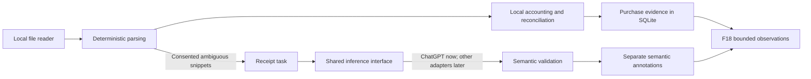

# Receipt learning plan

Accepted planning scope, 10 October 2026, after v0.6.0 publication. Reviewed source: `scratch/korikone_receipt_learning_pm_pitch.md`. Its RCP IDs and instructions are proposal material; canonical cards remain in the version task files. This plan describes future behavior, not the released importer.

## Delivery and reuse

v0.7.0 establishes a shared AI-provider contract and removes raw receipt text from ordinary shopping prompts. v0.9.0 adds structured purchase evidence, receipt accounting and learning. Local-model runtime support and additional live providers remain later work under F21. OCR remains F13 in v0.10.0; the initial importer handles text-bearing PDFs/TXT/CSV through the existing local reader.

Reuse F15 categories, qualifiers and explicit preferences, F16 compact context and task validation, F18 memory reads, existing SQLite/backups, Data/History and the optional uncertain-row review pattern. Receipt import is a separate explicit operation; it neither modifies the shopping list nor writes to a retailer. There is no additional memory store or permanent shopping-screen panel.

## Purchase facts and accounting

Keep source, purchase event, evidence lines, receipt-level adjustments and semantic interpretations distinct. Preserve sanitized labels and page/line spans. Store known money in integer cents and known weights/volumes in integer base units; retain verified piece counts, unit prices and printed totals. Missing quantities, dates, identities or discount allocations stay unknown.

Products, deposits, discounts, promotion groups and other lines have separate roles. Original promotional prices and paid prices must not be summed twice. Allocate a grouped discount to individual products only when the source supports that allocation. Reconciliation reports balanced, unbalanced or incomplete, with a visible difference where calculable. A printed total remains a source fact even if parsing cannot reproduce it; model output cannot balance a receipt or manufacture a food/non-food breakdown.

An identical import creates no additional purchase event. Reprocessing/correction updates the same source with provenance. Order/receipt overlap may link to one event when evidence is strong; ambiguous overlap asks for review rather than merging similar shopping trips. A verified transfer is shopping intent, not actual spending. It cannot establish a purchase or cadence by itself. The old half-the-items/three-days rule is insufficient for automatic confirmation.

Legacy `receiptText` remains compatible but has no trustworthy event boundaries. Migration preserves it as legacy source until explicit import/review; it must not fabricate dated purchase events or learning statistics from concatenated text.

Existing legacy raw text stays isolated from AI and normal purchase projections during migration. F6.5 must specify its sanitized backup projection and retention/deletion choice without overwriting the owner's existing backup files.

## Quiet import and consent

Show actual stages immediately: reading, identifying rows and checking totals. Present retailer/date when known, the printed total, recognized rows, unresolved quantities and reconciliation. Keep uncertainty in one small review entry. Users can skip, correct or accept interpretations for this receipt. These actions never implicitly save a household preference.

The owner chose local parsing by default. First import offers a small opt-in for automatic AI enrichment of sanitized ambiguous labels; the same setting is changeable in Settings. Consent states the selected provider and the exact fields shared, is versioned with that data scope, and is checked again when provider or scope changes. A connection to ChatGPT alone is not receipt consent. Manual enrichment of one receipt requires the same disclosure without enabling future automatic calls.

Use at most one batched enrichment request per explicit import/enrichment action. Cap rows, bytes and time; excess rows remain unresolved. No automatic repair/chunk/retry chain and no silent alternate-provider fallback. Explicit retry is a new bounded action on the same receipt. Failure or cancellation retains already committed local facts and prevents a late response from replacing corrections. Ordinary shopping keeps its independent maximum-three-call F16 policy.

AI receives only ambiguous sanitized descriptions, optional verified quantities and supplied category candidates. Exclude full PDFs, headers, loyalty/customer/payment identifiers, transaction references, unrelated rows and receipt totals. Result IDs must belong to the supplied batch. Task validation owns category/label proposals; no AI result can change quantities, money, source text, exact retailer identity or saved preferences. Treat imported text as untrusted data.

## Retention and private references

The owner chose sanitized evidence and purchase rows by default, with optional local retention of the original for inspection/reprocessing. Reading the selected file is local; retaining a copy requires an explicit choice. Deleting an app-retained copy does not delete the owner's external file. Explain how deleting source, semantic annotations or the entire purchase event affects dependent memory and dedupe. Backups include sanitized purchase records; original attachments require a separate explicit inclusion choice. Diagnostics contain no receipt contents or identifiers. Restore does not restore cloud consent implicitly.

Private real examples are under `scratch/receipts/`, already covered by the ignored `scratch/` directory. They are owner-held reference material, not uploadable fixtures. Source control contains independently authored sanitized examples of receipt layouts, without original PDFs, complete receipt transcripts or identifying metadata. This planning review did not upload or analyze the original files.

## Learning and suggestions

Facts about purchases, rule/model/user semantic interpretations, local statistical observations and explicit remembered preferences have separate provenance. Milk variants remain separate observations. A receipt label may map to a category or evidenced alias; it does not establish an exact SKU across stores, dietary safety, taste, pantry stock or consumption.

Preserve non-food purchases in receipt detail/history and accounting. Exclude them from meal-ingredient and usual-food suggestions unless explicitly requested. Use evidence-backed comparable quantities and purchase dates for local statistics. Two visits cannot establish reliable weekly cadence. Promotions, differing packs and incomplete observations must not manufacture a usual quantity.

Keep F6.3's existing recurrence threshold (at least four of eight weeks), maximum five suggestions and 90-day dismissal policy. Show evidence and period. Accepting a suggestion as recurring remains explicit; no automatic item addition. Typical quantities need a Strong-defined comparability rule and visible uncertainty before UI handoff.

F18 supplies a small relevant observation summary for requests such as "usual breakfasts". Explicit requirements and remembered preferences take precedence. Ordinary unrelated prompts receive no receipt history. Deletion removes dependent context on the next explicit request. Learning is local aggregation, not model training or external analytics.

## Provider boundary from v0.7.0

F16.16/F16.17 establish the shared seam now, before new planning/resolution code. Task modules own versioned requests/results, sanitized context, validation and repair/call policy. Providers own invocation, model discovery, capability/limit reporting, authentication/connectivity, streaming and cancellation. Keep AI-provider IDs separate from retailer-provider IDs.

ChatGPT is the only initially connected adapter and remains the default, using the existing account and model choice. Provider-scoped model identities and capability checks leave room for local and other providers. Unsupported capabilities return a typed unavailable result; a task may use prompt-and-validate within the selected provider where supported. Do not assume a common HTTP API or identical structured-output support. Fake alternative providers prove the seam without shipping a runner, credentials/settings UI for unavailable providers or downloads.

Receipt enrichment reuses this seam with its own schema and consent/call policy. F21 later wires an explicitly selected installed local endpoint through the same tasks and validators. Local failure cannot send data to ChatGPT. Other live cloud providers require their own credentials, disclosure and assigned integration scope.

## Pitch mapping and gates

| Pitch | Canonical work |
| --- | --- |
| RCP-01 compact context | Extend F16.5; provider foundation F16.16–F16.18 in v0.7.0 |
| RCP-02 shared evidence | F6.5; F6.1 order import uses the same schema |
| RCP-03 fixtures | F6.6 |
| RCP-04 / RCP-05 parsers | F6.7 / F6.8 |
| RCP-06 accounting | F6.9 |
| RCP-07 dedupe/import | F6.10; F6.2 integrates local receipt import |
| RCP-08–RCP-11 enrichment | F6.11–F6.14 |
| RCP-12 corrections/UX | F6.15–F6.16 local first; F6.21 enrichment controls |
| RCP-13 aliases | F6.17, F18.1 |
| RCP-14 quantities | F6.18, F6.3 |
| RCP-15 context/presentation | Extend F18.2 |
| RCP-16 source integrity | F6.19, F8.1, U5.1–U5.2 |
| RCP-17 quality/privacy | F6.20, F6.4, F18.5 |
| RCP-18 / RCP-19 later providers | Extend F21.2/F21.5/F21.6; optimization remains evidence-driven research |

Strong cards establish actual schemas, file boundaries and fixture contracts before Simple handoff. Proposed paths remain suggestions. Schema then fixtures enable separate K/S parser work; accounting/import and provider/enrichment can progress independently after their contracts. Shared service/main/schema files need a single owner per card.

Reference fixtures cover multi-unit lines, decimal produce weights, multi-page continuation, multiple milk variants, multiple groups of five pouches, campaigns, unallocated group discounts, deposits and printed food/non-food totals. Failures cover incomplete/unknown formats, duplicates, separate similar trips, injected text, invented IDs, cancellation/stale output, consent off, unsupported providers and backup/deletion. Expectations are authored independently of parser/model output. Zero wrong known quantities/prices, invented IDs, unauthorized cloud calls, duplicate exact imports and retailer writes are regression gates; coverage targets follow the baseline. Use focused evidence and the one-flow pre-release policy in AGENTS.md.

Remaining contract decisions belong to F6.5/F6.18/F6.19: source-retention bounds, quantity comparability and evidence thresholds for cross-source linking. Ambiguity remains visible/manual until those rules are specified. They do not block schema/fixture discovery. Actual-spend and food-only totals must be separately labelled; category coverage gaps remain visible.
